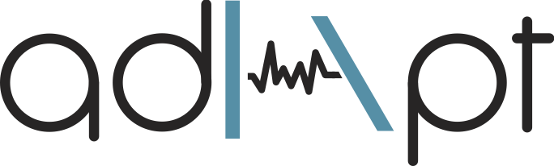

# ADAPT

**ADAPT** stands for **ADA**ptive **P**icking **T**oolbox. This package is a library
thought for seismologist and scientist that approach a seismic phase picking analysis.

This library aims to easening the creation of seismic catalogue by means of a semi-automated offline multi-phase repicking system.

AUTHOR: _Matteo Bagagli_

VERSION: _0.8.2_

DATE: _08.2022_

------------------------------

## Installation

In next releases, the framework will be available through PyPI.
At the moment, though, the installation is only possible from this repository.
Additionally, it is recommended to create a separate virtual environment with `conda` or `venv`
(e.g., `$ conda create -n adapt python=3.7`). Though, this is taken care by the
environment-file itself.

You can follow these simple commands.

```bash
$ git clone https://github.com/mbagagli/adapt  # use the master branch for stable releases
$ cd adapt
$ conda env create -f adapt_env.yml            # or use `adapt_env_noPickers.yml`
$ conda activate adapt-fw
$ pytest                                       # to check everything is ok
```

The framework supports at the moment 5 different picking algorithms that
can be used to create your own pipelines:

- the **Baer-Kradolfer** (Baer & Kradolfer, 1987)
- the **Bait** (Bagagli et al. 2020 - [GitHub](https://github.com/mbagagli/bait))
- the **Filter Picker** (Lomax et al. 2012 - [GitHub](https://github.com/mbagagli/filterpicker))
- the **Aurem** package (Bagagli et al. 2021 - [GitHub](https://github.com/mbagagli/aurem))
- the **Host** package (Bagagli et al. 2021a - [GitHub](https://github.com/mbagagli/host-picker))

Apart from the Baer-Kradolfer picker that is already included in the `obspy`
library, the other picking algorithms are separate libraries themselves.

If you're installing using the `adapt_env.yml` conda-environment file, they
will be installed automatically. If you don't want them to have them immediately,
use the `adapt_env_noPickers.yml` conda-environment file.
You could always install them at a later stage as follow:

```bash
$ conda activate adapt
$ pip install bait
$ pip install filterpicker
$ pip install aurem
$ pip install host-picker
```

Finally, you can also use these packages as stand-alone, individual,
pickers. Feel free to check their own repository, documentation and tutorials.

## Contribution

At the moment, the package is still undergoing a refactoring stage, with
improvements in documentation and tutorials.
You are defintely welcome to contribute to this project. The aim is
to create a useful and unified framework for seismic-phase picking, that
is both easy to use and highly customizable, not only for picking.
Please make sure to check the `CONTRIBUTING.md` and `CODE_OF_CONDUCT.md` files
beforehand and use them as reference.

Even if for a simple documentation changes, I'm looking forward for your pull request
and to add you in the contributors list! :)

## Citing and support

This framework and the individual picking packages presented here are
the results of an long, difficult yet satisfying coding journey.
If you are using one or more of these products in your research, please
consider citing these works using the references and the DOI provided.

For any bug-reports or if you would like to see additional improvements
in the package, please use the [issues](https://github.com/mbagagli/adapt/issues) panel above.

------------------------------

## Additional infos

Currently the package is relying on two major libraries that will
be removed in next releases: the `cartopy` and `pyrocko` project.
All of this because I aim to reduce the odds of possible libraries
conflicts to the minimum.

## References

- Baer, M., and U. Kradolfer (1987). "An automatic phase picker for local and teleseismic events." Bulletin of the Seismological Society of America 77.4 : 1437-1445.
- Bagagli, M., Kissling, E., Piccinini, D., & Saccorotti, G. (2020). Local earthquake tomography of the Larderello-Travale geothermal field. Geothermics, 83, 101731.
- Bagagli, M. (2021). mbagagli/aurem: aurempickers (v1.1.0). Zenodo. https://doi.org/10.5281/zenodo.5459631
- Bagagli, M. (2021a). mbagagli/host-picker: host-picker (v2.4.3). Zenodo. https://doi.org/10.5281/zenodo.5579442
- Lomax, A., C. Satriano and M. Vassallo (2012), Automatic picker developments and optimization: FilterPicker - a robust, broadband picker for real-time seismic monitoring and earthquake early-warning, Seism. Res. Lett. , 83, 531-540, doi: 10.1785/gssrl.83.3.531.
